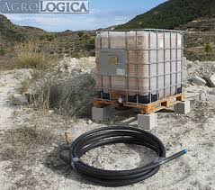
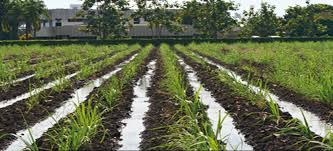

# 1.1) Patentes de Invención 

## Patente 1: Sistema de Riego Basado en Inteligencia Artificial

* **Número de publicación:** 2377394
* **Fecha de publicación:** 06.02.13
* **Inventor(es):** Fines Martínez Sergio, García Caso Sergio, Alonso Moral Jose María, Madgalena Layos Luis y Afif Khouri Elias.
* **Descripción del Sistema:**
  Muestra un Sistema de riego basado en inteligencia artificial que comprende:
  * Un sistema de adquisición de parámetros (1) configurado para tomar medidas de parámetros medioambientales.
  * Una unidad central de control (4) configurada para emitir órdenes de riego y almacenar y procesar las medidas recibidas del sistema de adquisición de parámetros (1). Esta unidad comprende un módulo inteligente (8) encargado de establecer un calendario de riego combinando algoritmos de control, normativas medioambientales y reglas de aprendizaje; un módulo verbalizador (9) encargado de explicar al usuario el calendario de riego; y unos medios de interacción (10) configurados para que el sistema interactúe con usuarios y dispositivos remotos.
  * Un dispositivo de comunicación (3) configurado para comunicar el sistema de adquisición de parámetros (1) con la unidad central de control (4).
  * Un dispositivo de adaptación de señal (5) configurado para transformar las órdenes de la unidad central (4) a señales entendibles por los actuadores de riego (6).
* **Fuente:** [Enlace a Google Patents](https://patents.google.com/patent/ES2905827T3/es)

  

***

## Patente 2: Sistema de Riego Automatizado, Remoto y Centralizado

* **Número de publicación:** 2311409
* **Fecha de publicación:** 01.02.2009
* **Inventor(es):** Samon Catella Jordi, Claus March Manel.
* **Descripción del Sistema:**
  Muestra un sistema de riego automatizado, remoto y centralizado del tipo de los que comprenden una pluralidad de dispositivos de riego controlados a distancia (remotamente) y desde un mismo punto (centralizadamente), siendo este punto de control cualquier punto del mundo dotado de un dispositivo capaz de navegar por internet. Asimismo, permite la gestión remota y centralizada del riego de extensas zonas, tal como los parques y jardines de una ciudad. Este sistema comprende:
  * Un ordenador servidor (1) de gestión de riegos, que presenta un dispositivo de conexión (11) a una red de comunicaciones (4) de acceso global para su gestión remota, un dispositivo de acceso a móviles (13) móvil o fijo y un dispositivo de servicio remoto (13).
  * Una serie de concentradores (2) de comunicación, los cuales comprenden un dispositivo de acceso a móvil (21) móvil o fijo, un microprocesador (22) y memoria (23) de almacenamiento de programas de riego, un equipo de radiofrecuencia (24) para la comunicación con unos dispositivos de riego (3), y una fuente de alimentación (25) eléctrica.
  * Una pluralidad de dispositivos de riego (3), con un módulo de comunicaciones (33) por radiofrecuencia para su activación, programación o consulta de estados a distancia desde un concentrador próximo y con una fuente de alimentación autónoma.
* **Fuente:** [Enlace a PatentScope WIPO](https://patentscope.wipo.int/search/es/detail.jsf?docId=ES5624811)

  

# 1.2) Prototipos

**Prototipo Tradicional 1: Sistema de Riego por Goteo Tecnificado por Gravedad**

En entornos agrícolas, huertos periurbanos o zonas rurales donde el acceso a la red eléctrica es inexistente o intermitente, los sistemas mecánicos que aprovechan la energía potencial gravitatoria representan el estándar operativo histórico. Este prototipo prescinde de motobombas eléctricas y utiliza tanques o tinacos elevados estratégicamente para generar la carga o presión hidrostática necesaria para empujar el fluido. En términos físicos, se requiere elevar el reservorio aproximadamente 10 metros de altura para generar 1 bar de presión, lo cual a menudo implica un desafío de infraestructura estructural.

El agua desciende a través de una red de tuberías principales y se distribuye capilarmente hacia las líneas de goteo. La regulación del caudal y la frecuencia de irrigación se realizan de forma estrictamente mecánica y manual mediante válvulas de paso. Si bien este método resuelve la dependencia energética, presenta limitaciones operativas severas: exige la presencia física constante de un operador humano para abrir y cerrar las válvulas en horarios específicos, y es altamente susceptible a la obstrucción de los goteros por sedimentos, al carecer de la presión necesaria para sistemas de filtrado avanzados. Además, al no contar con instrumentación, carece por completo de retroalimentación sobre las métricas climáticas o la humedad real del suelo. Esto impide una optimización precisa del recurso hídrico, derivando en riegos innecesarios si, por ejemplo, ocurre una lluvia imprevista.(1)

  

***

**Prototipo Tradicional 2: Sistema de Riego por Surcos o Infiltración**

El riego por gravedad superficial, específicamente la variante por surcos, constituye una de las metodologías de irrigación más antiguas y extendidas a nivel global debido a su nula barrera tecnológica de entrada. Su diseño hidráulico se basa en la conducción del agua desde reservorios naturales o artificiales ubicados en cotas topográficas superiores. El agua fluye de manera libre por acción de la gravedad, recorriendo canales abiertos o zanjas excavadas directamente en la tierra de cultivo para infiltrarse paulatinamente en la zona de las raíces.

Para que este sistema sea medianamente funcional, existe una dependencia topográfica crítica: el terreno debe estar nivelado con una pendiente topográfica mínima y uniforme. De lo contrario, el agua se estanca (generando pudrición radicular y asfixia en las plantas) o fluye demasiado rápido (causando erosión y estrés hídrico). Si bien su costo de instrumentación electrónica es nulo, la literatura agronómica señala que este sistema presenta una eficiencia de aplicación hídrica extremadamente deficiente (frecuentemente inferior al 50%). La ausencia de control volumétrico provoca pérdidas masivas de agua por evaporación directa a la atmósfera, escorrentía superficial incontrolada y percolación profunda (el agua se hunde más allá del alcance de las raíces). Adicionalmente, este exceso de agua arrastra los fertilizantes (lixiviación) y fomenta el crecimiento masivo de malezas en toda la superficie húmeda, justificando técnica y ambientalmente la transición hacia sistemas de automatización localizada y predictiva.(2)

  

***

## Referencias Bibliográficas (Estilo Vancouver)

1. TvAgro. Instalación de un Sistema de Riego por Goteo [Video en Internet]. YouTube; [citado 2026 Abr 07]. Disponible en plataformas de distribución de video.
2. Brouwer C, Prins K, Heibloem M. Irrigation Water Management: Irrigation Methods. Training Manual No 5. Roma: Food and Agriculture Organization of the United Nations (FAO); 1988 [citado 2026 Abr 07].

# 1.3) Productos Comerciales 

**Producto Comercial 1: Temporizador de manguera solar inteligente Netro Pixie**

En la gestión de huertos urbanos y jardines residenciales, uno de los factores más críticos es lograr la autonomía energética y la conectividad a internet sin depender de cableados o tomas eléctricas en exteriores. Para automatizar los ciclos de irrigación sin intervenir con la infraestructura eléctrica del hogar, se utilizan programadores de válvula que se acoplan directamente a la toma de agua.

En este contexto, el Netro Pixie es un controlador de riego sin contacto eléctrico externo que permite conectarse a redes Wi-Fi de 2.4 GHz y se alimenta de forma autónoma mediante un panel solar fotovoltaico de alta eficiencia. Puede detectar variaciones meteorológicas a través de su conexión a la nube y calcular la evapotranspiración (ET) del entorno para ajustar los tiempos de riego dinámicamente, demostrando que la integración de cosecha de energía solar con conectividad directa a internet es una tecnología madura y patentable.(1)

  

***

**Producto Comercial 2: Sensor inteligente de humedad y temperatura GARDENA**

En el proceso de optimización del riego, uno de los momentos más críticos es determinar el nivel exacto de saturación del sustrato, ya que factores como la compactación del suelo urbano o el calor excesivo pueden alterar la retención hídrica y afectar la supervivencia de la planta. Para monitorear estos eventos radiculares sin basarse únicamente en estimaciones climáticas, se pueden utilizar sensores que detecten cambios termodinámicos o dieléctricos en la tierra.

En ese contexto, el GARDENA smart Sensor es un dispositivo inalámbrico que se entierra a nivel de las raíces y permite medir la humedad volumétrica del suelo y la temperatura ambiente con alta precisión. Transmite estas variaciones hídricas a un enrutador central de radiofrecuencia para interrumpir automáticamente un programa de riego si la tierra ya está lo suficientemente húmeda, sin necesidad de realizar excavaciones constantes ni desperdiciar recursos hídricos.(2)

  

***

**Producto Comercial 3: Sistema de riego automático solar por goteo con bomba RainPoint Gen 2**

Para ecosistemas de plantas confinados en balcones, terrazas o interiores de edificios, la falta de una llave de agua presurizada representa una barrera física para la automatización. El suministro hídrico debe ser extraído de reservorios estáticos (como tanques o baldes) sin comprometer el consumo energético y manteniendo un monitoreo constante para evitar averías mecánicas por trabajo en seco.

En este sentido, el RainPoint Gen 2 es un sistema IoT portátil que funciona con paneles solares y alberga una micromotor de bombeo integrado. Utiliza un sistema de succión que extrae el agua de un balde y la distribuye por una red capilar de goteo, operando de manera completamente autónoma a la red municipal. Esto ayuda a preservar la humedad de plantas en macetas aisladas y cuenta con un sistema predictivo que detiene la bomba y envía una alerta al celular si detecta que el balde se ha quedado sin agua.(3)

  

***

## Referencias Bibliográficas (Estilo Vancouver)

1. Netro Inc. Netro Pixie Smart Hose Faucet Timer User Manual [Internet]. Portland (OR): Netro Inc; 2023 [citado 2026 Abr 07]. Disponible en: https://netrohome.com/shop/products/pixie
2. GARDENA. smart Sensor Instruction Manual [Internet]. Ulm (Alemania): Husqvarna AB; 2022 [citado 2026 Abr 07]. Disponible en: https://www.gardena.com/
3. RainPoint. Gen 2 Smart WiFi Solar Automatic Plant Watering System [Internet]. Chino (CA): RainPoint; 2024 [citado 2026 Abr 07]. Disponible en: https://www.rainpointonline.com/