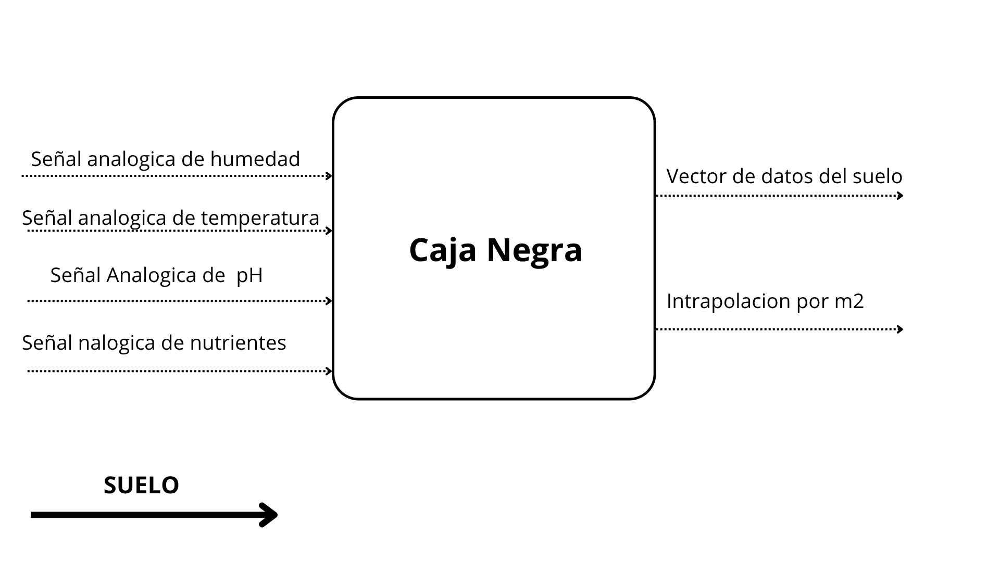
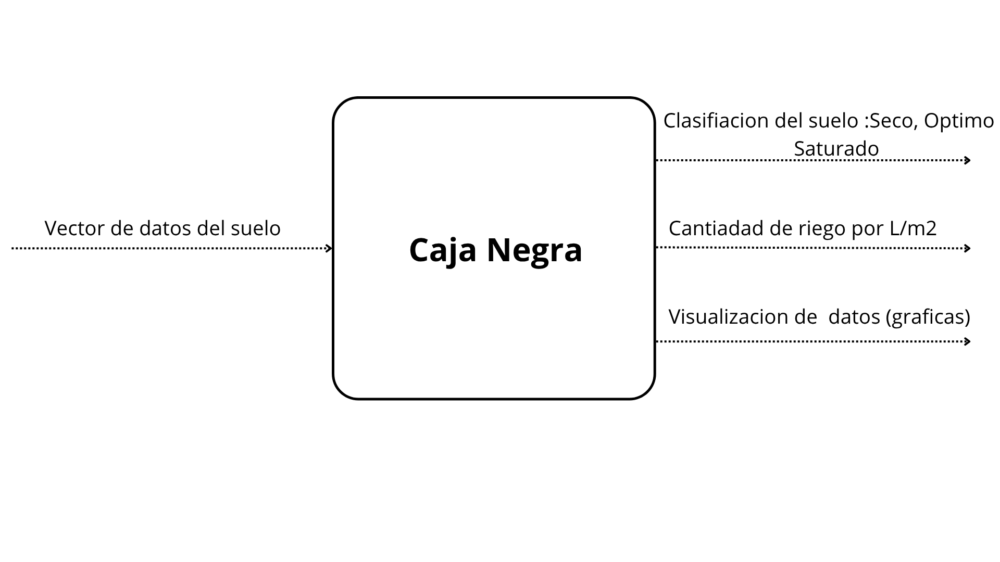

# Caja negra

## Sección 1: Recibe las señales del suelo las convierte en datos digitales

  

## Sección 2: Tomamos esos datos y mediante interpolación genera la cantidad de riego recomendada

  

