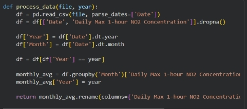
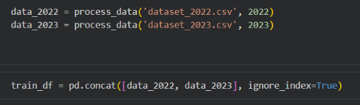
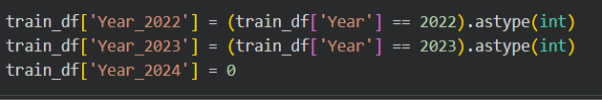
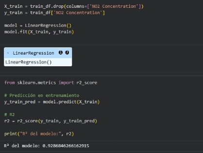
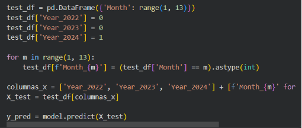
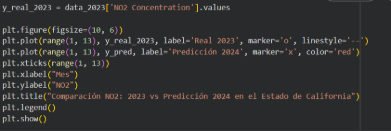
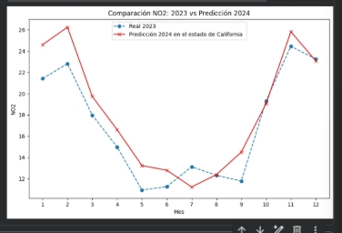
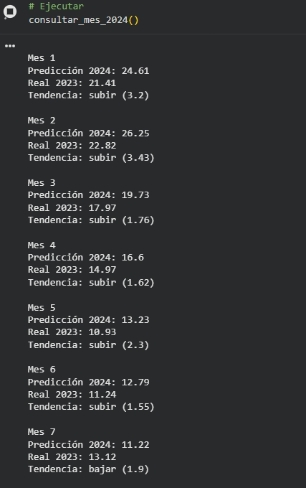

# **PREDICCIÓN DE LA CONCENTRACIÓN DE NO**₂  **MEDIANTE REGRESIÓN LINEAL**  **Introducción:** 
La contaminación atmosférica es uno de los principales problemas ambientales en zonas urbanas, con efectos directos en la salud pública y el equilibrio ecológico. Entre los contaminantes más relevantes se encuentra el dióxido de nitrógeno (NO₂), el cual está asociado principalmente a emisiones provenientes del tráfico vehicular y actividades industriales [1]. 

El análisis de series temporales ambientales permite identificar patrones de comportamiento y tendencias futuras de contaminantes. Es por ello que el presente trabajo tiene como objetivo desarrollar un modelo predictivo basado en **regresión lineal** para estimar la concentración mensual de NO₂ en el año 2024, utilizando datos históricos de 2022 y 2023 del estado de California .El uso de técnicas de aprendizaje automático en problemas ambientales ha demostrado ser útil para la predicción de contaminantes y apoyo a la toma de decisiones [2]. 
## **Metodología:** 
El desarrollo del estudio se realizó en varias etapas, siguiendo un flujo típico de análisis de datos y modelado predictivo  explicado en clases . 
1. ### **Procesamiento de datos** 
Se trabajó con datasets en formato CSV que contienen registros diarios de concentración de NO₂(2022-2023). Posterior a ello Estos datos fueron preprocesados :  

2. **Integración de datos** 

Los datos correspondientes a los años 2022 y 2023 fueron combinados en un único conjunto  mediante concatenación de estructuras tipo DataFrame. Este proceso permite consolidar información histórica para el aprendizaje del modelo [4]. 

3. ### **Codificación de variables** 
### Utilizada para transformar variables categóricas en representaciones numéricas binarias. Esta técnica es ampliamente utilizada en modelos de aprendizaje automático, especialmente en modelos lineales [2]. 

4. ### **Construcción del modelo** 
Se implementó un modelo de **Regresión Lineal**, el cual asume una relación lineal entre las variables independientes y la variable objetivo. Este modelo es uno de los más utilizados debido a su simplicidad, interpretabilidad y eficiencia computacional [5]. 

5. ### **Generación de predicciones** 
Se construyó un conjunto de datos sintético correspondiente al año 2024, manteniendo la misma estructura de variables del conjunto de entrenamiento. El modelo fue utilizado para predecir la concentración mensual de NO₂ para dicho año. 

6. ### **Visualización de resultados** 
Se realizó una comparación gráfica entre los valores reales del año 2023 y las predicciones del año 2024. La visualización de  resultados nos permite  el análisis de datos para interpretar patrones y tendencias [3]. 

## ` `**Resultados** 
El modelo de regresión lineal permitió estimar la concentración de NO₂ para cada mes del año 2024, generando una serie de valores que reflejan la posible evolución del contaminante en función de patrones históricos. 

Los resultados muestran una tendencia que sigue el comportamiento observado durante el año 2023, lo que sugiere la presencia de patrones estacionales en la concentración de NO₂. En particular, se identifican variaciones mensuales que podrían estar asociadas a factores recurrentes como condiciones climáticas. 

La representación gráfica facilita la comparación entre los valores reales y predichos, evidenciando similitudes en la forma de las curvas, así como posibles diferencias en magnitud para determinados meses. Estos resultados constituyen una aproximación inicial al comportamiento esperado del contaminante en el año 2024. 
## **Discusión:**  
Los resultados obtenidos evidencian que el modelo de regresión lineal es capaz de capturar patrones generales en la variación mensual de la concentración de NO₂, particularmente aquellos asociados a la estacionalidad. La similitud observada entre el comportamiento histórico de los datos y las predicciones realizadas sugiere que existe una estructura temporal relativamente estable en el corto plazo. 

Para evaluar cuantitativamente el desempeño del modelo, se utilizó el coeficiente de determinación (R²), el cual mide la proporción de la variabilidad de la variable dependiente que es explicada por el modelo. En este caso, el valor deL R² del modelo: 0.9286846266162915 obtenido refleja un ajuste moderado, lo que indica que el modelo logra representar tendencias generales de los datos, pero aún existen variaciones que no son completamente explicadas por las variables utilizadas.Este resultado es esperable debido a la simplicidad del enfoque empleado, ya que la regresión lineal asume una relación lineal entre las variables independientes (mes y año) y la variable objetivo (concentración de NO₂). Sin embargo, el comportamiento de la contaminación atmosférica es inherentemente multicausal y no lineal, ya que depende de factores adicionales como condiciones meteorológicas, intensidad del tráfico vehicular, actividad industrial y políticas ambientales, los cuales no fueron incluidos en este análisis. 

REFERENCIAS: 

1. A. Géron, *Hands-On Machine Learning with Scikit-Learn, Keras, and TensorFlow*, O’Reilly Media, 2022. 
1. W. McKinney, *Python for Data Analysis*, O’Reilly Media, 2017. 
1. J. Han, M. Kamber, and J. Pei, *Data Mining: Concepts and Techniques*, Morgan Kaufmann, 2011. 
1. T. Hastie, R. Tibshirani, and J. Friedman, *The Elements of Statistical Learning*, Springer, 2009. 
