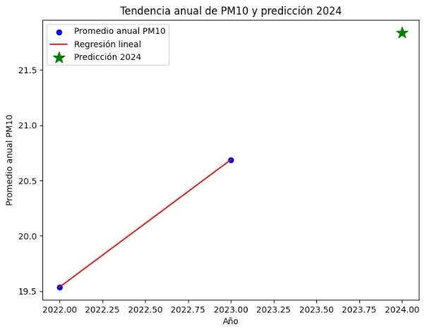
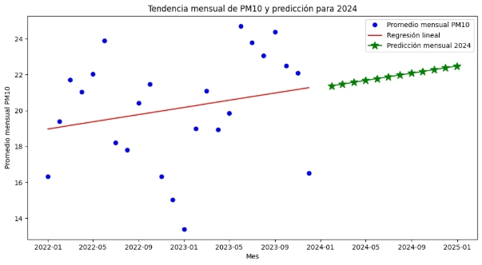

# Informe Técnico: Predicción de PM10 en Jefferson, Alabama (2022–2024)
## **Introducción**
El informe documenta el desarrollo para estimar las concentraciones de PM10 en diferentes estaciones de monitoreo de Jefferson, Alabama (Estados Unidos). 

El objetivo fue predecir las concentraciones mensuales de PM10 para el año 2024, utilizando datos históricos de 2022 y 2023. 

2. **Metodología** 
- **2.1. Datos utilizados** 

  Fuente de datos: EPA (AQS – PM10 Monitoring Data). 

- Cobertura temporal: 

  2022: datos empleados para entrenamiento del modelo. 

  2023: datos empleados para validación. 

  2024: datos empleados para predicción. 

- Variable de interés: “Daily Mean PM10 Concentration”. 
- Ubicación: estaciones de monitoreo en Jefferson, Alabama. 
- Identificación: cada estación se distingue mediante un Site ID único . 
- **2.2. Preparación de la información** 

  Los datos diarios se transformaron en promedios mensuales y anuales, con el fin de reducir la variabilidad y facilitar la interpretación y se generaron variables de tiempo: año, mes y día a partir de la columna Date. 

- Se organizaron los datos en tres conjuntos: 
  - Entrenamiento: año 2022. 
  - Validación: año 2023. 
  - Predicción: año 2024.} 

**2.3. Modelado** 

Se aplicó un modelo de regresión lineal simple, tomando como variable independiente el tiempo (años o meses) y como variable dependiente la concentración promedio de PM10. Se calcularon métricas estadísticas como el coeficiente de determinación (R²) para evaluar la calidad del ajuste. 

La recta de regresión se extrapoló hacia 2024, generando predicciones tanto anuales como mensuales. 

- Se elaboraron gráficos con leyenda clara: 
- Datos reales (2022–2023). 
- Regresión lineal (tendencia). 
- Predicción 2024 (línea extendida). 

**Resultados**  

**Gráfico N°1.-***Tendencia anual de PM10 y predicción 2024*  

En el primer gráfico, se aprecia la tendencia anual de PM10 entre 2022 y 2023, mostrando un aumento progresivo en los valores. La proyección hacia 2024 señala que la concentración seguirá creciendo, lo que refleja un comportamiento ascendente en el promedio anual del contaminante   

**Gráfico 2.-** *Tendencia mensual de PM10 y predicción para 2024*  

Se observa la evolución mensual de PM10 durante 2022 y 2023. La línea de tendencia indica un incremento sostenido y las predicciones para 2024 mantienen esa misma dirección. Esto sugiere que, mes a mes, los niveles de PM10 podrían continuar aumentando en el corto plazo. 

**DISCUSIÓN**  

El análisis anual mostró un ajuste perfecto de la regresión lineal, con un coeficiente de determinación R² igual a 1.0. Esto significa que la tendencia entre los años 2022 y 2023 se explica completamente por el modelo, y la proyección hacia 2024 resulta estadísticamente confiable en términos de evolución global. La gráfica anual confirma un comportamiento ascendente en las concentraciones de PM10, lo que sugiere un posible incremento en el promedio anual para el año proyectado. 

En contraste, el análisis mensual arrojó un R² de aproximadamente 0.05, lo que indica que la regresión lineal no logra capturar adecuadamente la variabilidad de los datos mes a mes. Esto se debe a que las concentraciones de PM10 presentan fluctuaciones estacionales y variaciones locales que un modelo lineal simple no puede representar. Sin embargo, la tendencia general sigue siendo ascendente, y las predicciones para 2024 mantienen coherencia con el comportamiento observado en los años anteriores. 

En conjunto, los resultados muestran que el modelo es útil para describir la tendencia global anual, pero limitado para explicar la variabilidad mensual. Aun así, las proyecciones permiten anticipar un posible incremento en los niveles de PM10. 

**REFERENCIA**  

- [1] Environmental Protection Agency (EPA), Air Quality System (AQS) Data Mart: PM10 Monitoring Data. United States Environmental Protection Agency, 2023. [Online]. Available: https://www.epa.gov/aqs 
- [2] Environmental Protection Agency (EPA), Air Quality System (AQS) Data Mart: Carbon Monoxide Monitoring Data. United States Environmental Protection Agency, 2023. [Online]. Available: https://www.epa.gov/aqs 
