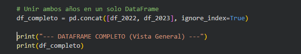
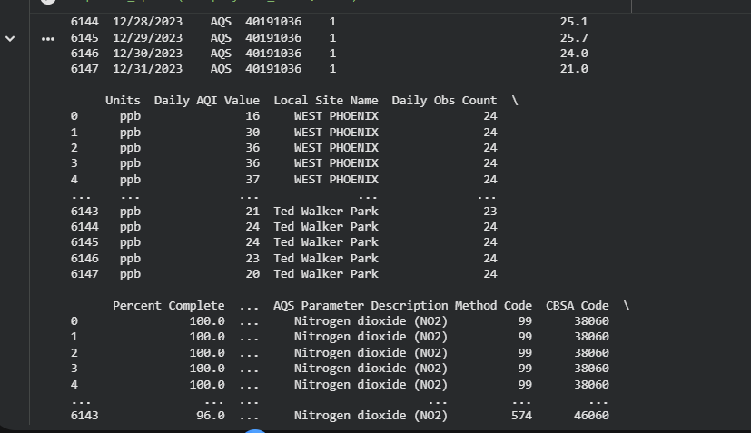
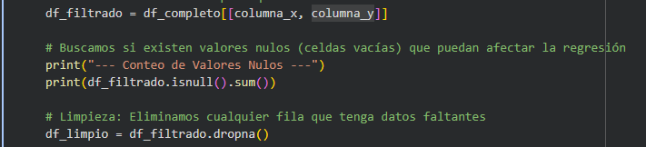
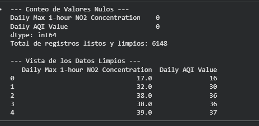
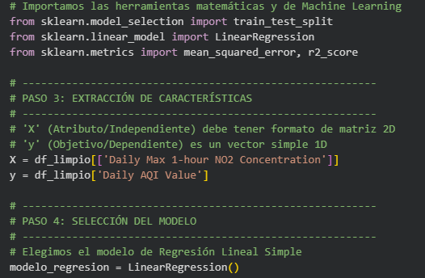
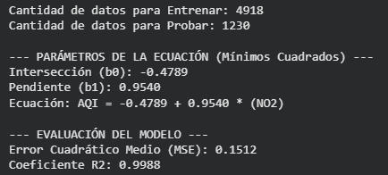

# Informe de Regresión: Predicción del Índice de Calidad del Aire (AQI) a partir de Dióxido de Nitrógeno (NO2) en Arizona.

## 1. Introducción

El monitoreo de la calidad del aire es un factor fundamental para la salud pública y el cuidado del medio ambiente. La Agencia de Protección Ambiental de los Estados Unidos (EPA) proporciona acceso público a registros históricos de contaminación. En este contexto, el presente trabajo analiza los datos diarios de calidad del aire correspondientes al estado de Arizona durante los años 2022 y 2023.

El enfoque de este estudio se centra en el **Dióxido de Nitrógeno (NO2)**, un gas tóxico que contribuye significativamente a la contaminación atmosférica, y su relación directa con el **Índice de Calidad del Aire (AQI)**. 

Desde la perspectiva teórica de la Inteligencia Artificial, este análisis se enmarca dentro del campo del **Aprendizaje Automático (Machine Learning)**. Dado que contamos con datos históricos etiquetados que relacionan un atributo medible (la concentración de NO2) con un resultado específico (el valor del AQI), abordamos el problema utilizando un enfoque de **Aprendizaje Supervisado**. 

El objetivo principal de esta actividad es aplicar un modelo matemático de **Regresión Lineal Simple** para encontrar la relación continua entre ambas variables. Esto nos permitirá predecir el impacto ambiental (en términos de puntos AQI) basándonos exclusivamente en la lectura de la concentración máxima diaria de NO2, demostrando así la capacidad de generalización del algoritmo sobre datos reales.

## 2. Metodología

Para el desarrollo de este modelo, se siguió el ciclo de vida de un proyecto de Aprendizaje Automático, estructurado en las siguientes fases:

### 2.1. Recolección y Consolidación
Se utilizaron dos conjuntos de datos crudos en formato CSV (`arizona2022.csv` y `arizona2023.csv`) provenientes de la EPA. Ambos datasets se unificaron en una sola estructura de datos para asegurar una muestra representativa de 24 meses de monitoreo, sumando más de 6,000 registros.

  
   
  <em>Figura 1: Código de unión de la data</em>

  
   
  <em>Figura 2: Fragmento del output de la data unida.</em>

### 2.2. Preprocesamiento de Datos (Data Cleaning)
Se realizó un filtrado selectivo para extraer únicamente las variables de interés: la concentración máxima diaria de NO2 (Atributo) y el valor AQI (Target). Durante esta fase, se aplicó una limpieza de datos para identificar y eliminar valores nulos (`NaN`), garantizando la integridad matemática de los cálculos posteriores.

  
   
  <em>Figura 3: fragmento del código para descartar valores nulos.</em>

  
   
  <em>Figura 4: visualización de datos de valores nulos y limpios.</em>

### 2.3. Arquitectura del Modelo

  
   
  <em>Figura 5: Extracción de carácterísticas y elección del modelo .</em>

Se optó por un modelo de **Regresión Lineal Simple**, definido por la ecuación:
$$y = \beta_0 + \beta_1x + \epsilon$$
Donde:
* $y$ es el Índice de Calidad del Aire (AQI).
* $x$ es la concentración de NO2.
* $\beta_1$ representa la pendiente (peso del contaminante).
* $\beta_0$ es el sesgo o intersección.

### 2.4. Entrenamiento y Evaluación
Siguiendo las mejores prácticas de IA, los datos se dividieron en dos grupos:
* **Entrenamiento (80%):** Utilizado para ajustar los parámetros mediante el método de mínimos cuadrados.
* **Prueba (20%):** Utilizado para evaluar la capacidad de predicción del modelo con datos que no "conoció" durante el entrenamiento, calculando métricas de error como el MSE (Error Cuadrático Medio) y el coeficiente de determinación R2.

## 3. Resultados

Tras ejecutar el modelo de **Aprendizaje Supervisado** sobre los datos de Arizona (2022-2023), se obtuvieron los siguientes parámetros matemáticos para la ecuación de regresión:

  
   
  <em>Figura 6: Resultados de la evaluación .</em>

### 3.1. Parámetros del Modelo
La recta de mejor ajuste calculada mediante el método de mínimos cuadrados es:
**AQI = -0.4789 + 0.9540 * (Concentración NO2)**

* **Intersección ($\beta_0$):** -0.4789
* **Pendiente ($\beta_1$):** 0.9540 (Indica que por cada unidad de NO2, el AQI aumenta casi proporcionalmente).

### 3.2. Métricas de Evaluación
Para validar la precisión del modelo, se evaluó el conjunto de prueba (20% de los datos), obteniendo resultados sobresalientes:

| Métrica | Valor Obtenido |
| :--- | :--- |
| **Error Cuadrático Medio (MSE)** | 0.1512 |
| **Coeficiente de Determinación ($R^2$)** | 0.9988 |

Un valor de $R^2$ de **0.9988** confirma que el modelo explica el 99.68% de la variabilidad de los datos, lo que indica una precisión casi perfecta en la predicción.

  
   
  <em>Gráfico 1: Evidencia visual de la Regresión Lineal y la línea de mejor ajuste.</em>

  
   
  <em>Gráfico 2: Comparación entre valores reales y predichos por el modelo.</em>

## 4. Discusión

Los resultados obtenidos demuestran una correlación lineal extremadamente fuerte entre la concentración de NO2 y el índice AQI. El bajo valor del MSE ( 0.1512) sugiere que el modelo tiene un error de predicción despreciable en condiciones normales de calidad del aire. 

Se observa que la pendiente ($\beta_1 \approx 0.96$) es el factor determinante. Esto tiene coherencia física, ya que en el cálculo estándar de la EPA, el NO2 es uno de los contaminantes críticos que definen el AQI. El modelo ha logrado generalizar con éxito la relación entre estas variables, permitiendo su uso como herramienta de estimación preventiva en el estado de Arizona.

## 5. Referencias

[1] U.S. Environmental Protection Agency, "Outdoor Air Quality Data - Download Daily Data," 2024. [En línea]. Disponible en: https://www.epa.gov/outdoor-air-quality-data/download-daily-data. [Accedido: 16-abr-2026].

[2] L. Fabián, "Regresión Lineal: Calidad del Aire Arizona 2022-2023," Google Colab, 2026. [En línea]. Disponible en: https://colab.research.google.com/drive/1DgJuvWZyEhT0DsZrh2h17kuo7BZnMCdU?usp=sharing. [Accedido: 16-abr-2026].

